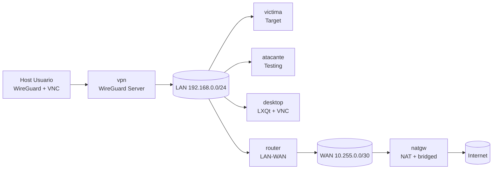
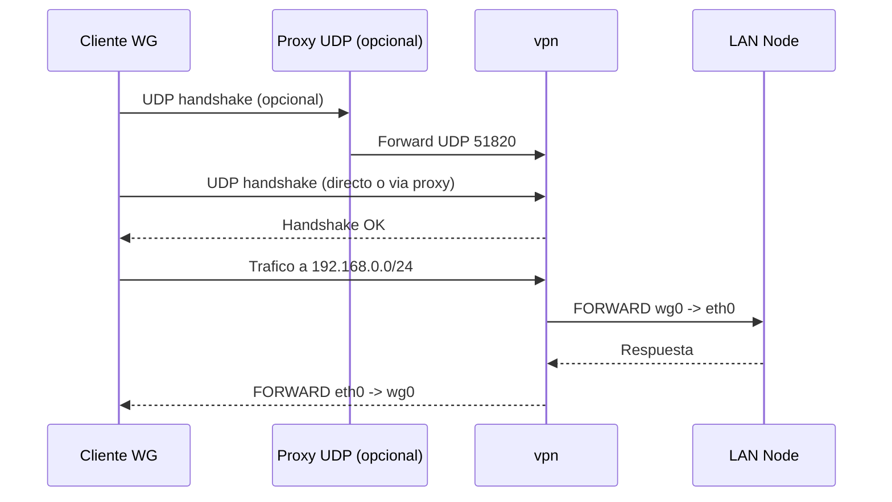
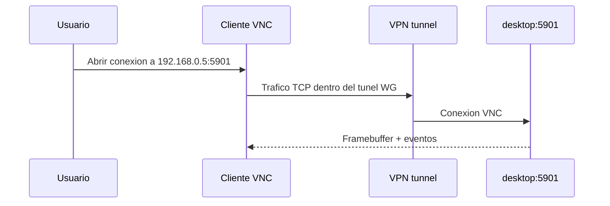
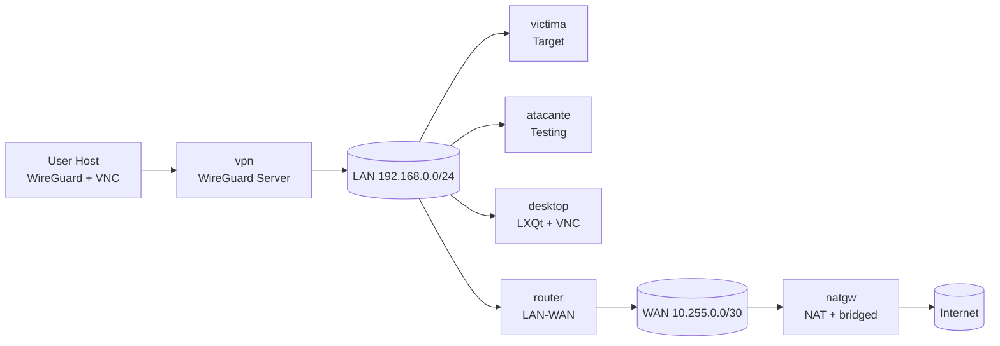
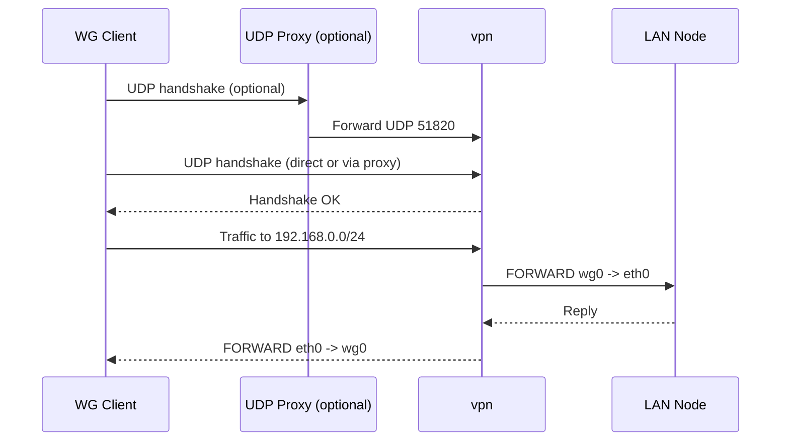
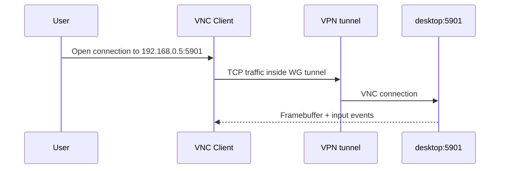

# Architecture - p2_2

Navigation / Navegacion: [Index](INDEX.md) | [Guide](README.md) | [Quickstart](QUICKSTART.md) | [Architecture](ARCHITECTURE.md) | [Network](NETWORK.md) | [Examples](EXAMPLES.md) | [Docker](DOCKER.md)

## Espanol

## 1. Vista de componentes

## 2. Capas funcionales

1. Acceso remoto
   - `vpn` expone WireGuard para entrar desde el host.
   - En macOS/Windows se puede activar proxy UDP local de forma automatica.
2. Capa de laboratorio
   - `victima` y `atacante` comparten LAN privada.
   - `desktop` permite trabajo visual y analisis desde GUI.
3. Capa de salida
   - `router` conecta LAN a WAN.
   - `natgw` aplica NAT hacia la red del host/Internet.

## 3. Flujo de acceso VPN

## 4. Flujo de acceso VNC

## 5. Roles por nodo

| Nodo | Funcion principal | Servicios |
|---|---|---|
| `victima` | Host objetivo en LAN | Servicios de practica (segun ejercicio) |
| `atacante` | Host de pruebas y ataque | Herramientas CLI del laboratorio |
| `desktop` | Entorno grafico remoto | VNC `5901`, LXQt, qterminal, firefox, featherpad, wireshark |
| `vpn` | Entrada remota segura | WireGuard `51820/udp`, NAT/FORWARD iptables |
| `router` | Enrutamiento LAN-WAN | `ip_forward=1`, ruta por defecto a `natgw` |
| `natgw` | NAT hacia host/Internet | MASQUERADE y forward WAN |

## 6. Seguridad operacional

- El acceso remoto principal es WireGuard, no VNC publicado al host.
- VNC solo es accesible dentro de la LAN del laboratorio (o via tunel VPN).
- El cliente WireGuard se limita a `WG_ALLOWED_IPS=192.168.0.0/24` por defecto.
- Las claves del cliente/servidor se generan en `./shared/vpn`.

## 7. Modos de arranque

- Completo: `./start-lab.sh`
  - arranca todos los nodos
  - prepara WireGuard
  - deja listo VNC en `desktop`
- CLI-only: `./start-lab.sh --cli-only`
  - arranca `victima`, `atacante`, `router`, `natgw`
  - omite `vpn` y `desktop`

---

## English

## 1. Component view

## 2. Functional layers

1. Remote access
   - `vpn` exposes WireGuard for host entry.
   - On macOS/Windows, local UDP proxy may be auto-enabled.
2. Lab layer
   - `victima` and `atacante` share the private LAN.
   - `desktop` provides visual workspace and GUI analysis.
3. Egress layer
   - `router` connects LAN to WAN.
   - `natgw` applies NAT to host network/Internet.

## 3. VPN access flow

## 4. VNC access flow

## 5. Node roles

| Node | Main function | Services |
|---|---|---|
| `victima` | Target host in LAN | Practice services (exercise-specific) |
| `atacante` | Testing and attack host | CLI tools in lab image |
| `desktop` | Remote graphical workspace | VNC `5901`, LXQt, qterminal, firefox, featherpad, wireshark |
| `vpn` | Secure remote entry | WireGuard `51820/udp`, iptables NAT/FORWARD |
| `router` | LAN-WAN routing | `ip_forward=1`, default route to `natgw` |
| `natgw` | NAT to host/Internet | MASQUERADE and WAN forwarding |

## 6. Operational security

- Primary remote entry is WireGuard, not host-published VNC.
- VNC is only reachable inside lab LAN (or via VPN tunnel).
- WireGuard client scope is limited by default to `192.168.0.0/24`.
- Client/server keys are generated under `./shared/vpn`.

## 7. Startup modes

- Full: `./start-lab.sh`
  - starts all nodes
  - prepares WireGuard
  - enables VNC in `desktop`
- CLI-only: `./start-lab.sh --cli-only`
  - starts `victima`, `atacante`, `router`, `natgw`
  - skips `vpn` and `desktop`

---

Navigation / Navegacion: [Index](INDEX.md) | [Guide](README.md) | [Quickstart](QUICKSTART.md) | [Architecture](ARCHITECTURE.md) | [Network](NETWORK.md) | [Examples](EXAMPLES.md) | [Docker](DOCKER.md)
