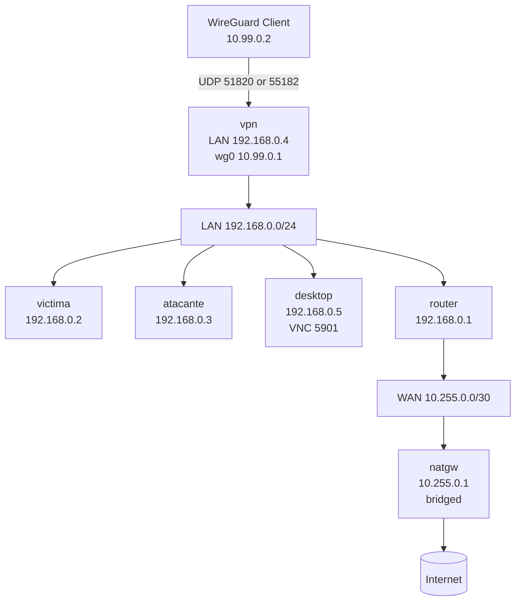

# p2_2 - Guia Completa

Navigation / Navegacion: [Index](INDEX.md) | [Guide](README.md) | [Quickstart](QUICKSTART.md) | [Architecture](ARCHITECTURE.md) | [Network](NETWORK.md) | [Examples](EXAMPLES.md) | [Docker](DOCKER.md)

Navegacion rapida: `INDEX.md`

## 1. Descripcion general

Este escenario extiende la practica p2_2 original con dos capacidades clave:

- acceso remoto seguro por WireGuard
- entorno grafico LXQt accesible por VNC

La topologia final tiene 6 nodos:

- `victima`: host objetivo en LAN
- `atacante`: host de pruebas en LAN
- `router`: enrutamiento entre LAN y WAN
- `natgw`: salida a Internet mediante NAT
- `vpn`: servidor WireGuard para acceso remoto
- `desktop`: escritorio grafico para trabajo remoto

Tambien incluye un modo `CLI-only` para ejecutar la practica sin VPN ni GUI.

## 2. Topologia



## 3. Direccionamiento y roles

| Nodo | IP principal | Imagen | Memoria | Rol |
|---|---|---|---|---|
| `victima` | `192.168.0.2/24` | `kathara/base` | `512m` | Objetivo en LAN |
| `atacante` | `192.168.0.3/24` | `kathara/base` | `1024m` | Host de pruebas |
| `router` | `192.168.0.1/24`, `10.255.0.2/30` | `kathara/base` | `256m` | Gateway LAN-WAN |
| `natgw` | `10.255.0.1/30` | `kathara/base` | `256m` | NAT hacia host/Internet |
| `vpn` | `192.168.0.4/24`, `10.99.0.1/24` | `kathara-vpn` | `256m` | Servidor WireGuard |
| `desktop` | `192.168.0.5/24` | `kathara-desktop` | `1024m` | LXQt + VNC |

## 4. Requisitos

- Docker funcionando
- Kathara instalado y operativo
- Cliente WireGuard en el host
- Cliente VNC (TigerVNC, RealVNC, etc.)

## 5. Instalacion

Desde `kathara_migration_p2_2`:

```bash
docker build -t kathara-desktop -f Dockerfile.desktop .
docker build -t kathara-vpn -f Dockerfile.vpn .
chmod +x start-lab.sh stop-lab.sh verify.sh
```

## 6. Arranque en modo completo (recomendado)

```bash
./start-lab.sh
```

Este script:

- arranca o reutiliza nodos base (`victima`, `atacante`, `router`, `natgw`)
- arranca `vpn` y `desktop`
- detecta si el mapeo UDP `51820/udp` es usable
- si hace falta, crea proxy UDP local (`wg-proxy` en `55182/udp`)
- ajusta `Endpoint` en `./shared/vpn/student1.conf`

### Conexion remota

1. Importar `./shared/vpn/student1.conf` en WireGuard.
2. Activar tunel.
3. Abrir VNC a `192.168.0.5:5901`.
4. Password VNC: `password`.

## 7. Arranque en modo CLI-only

```bash
./start-lab.sh --cli-only
```

En este modo se arrancan solo:

- `victima`
- `atacante`
- `router`
- `natgw`

No se levanta WireGuard ni escritorio VNC.

## 8. Verificacion

### Verificacion completa

```bash
./verify.sh --wait-for-handshake 30
```

Comprueba:

- forwarding y rutas
- conectividad LAN y salida WAN/Internet
- estado VNC y apps GUI en `desktop` (si activo)
- estado WireGuard, endpoint y handshake (si `vpn` activo)

### Verificacion sin ping desde host

```bash
./verify.sh --wait-for-handshake 30 --skip-host-ping
```

### Diagnostico extendido

```bash
./verify.sh --wait-for-handshake 30 --verbose
```

## 9. Parada

```bash
./stop-lab.sh
```

Realiza:

- `kathara lclean`
- borrado de proxy UDP local (`wg-proxy`) si existe

## 10. Aplicaciones en desktop

El escritorio (`kathara-desktop`) incluye:

- `qterminal`
- `firefox-esr`
- `featherpad`
- `wireshark`

Tema visual: LXQt oscuro con `openbox`.

## 11. Troubleshooting rapido

### WireGuard aparece activo pero no hay conectividad

Comprobar handshake real en servidor:

```bash
kathara exec -d "$(pwd)" vpn "wg show"
```

Si no hay `latest handshake`:

```bash
./start-lab.sh --force-proxy
```

Reimportar `./shared/vpn/student1.conf` y reconectar.

### No conecta VNC

```bash
kathara exec -d "$(pwd)" desktop "ss -ltn"
```

Debe aparecer `:5901` en escucha.

### Error por directorio en comandos Kathara

Usar `-d` explicito:

```bash
kathara exec -d /ruta/a/kathara_migration_p2_2 vpn "wg show"
```

## 12. Configuracion relevante

Variables WireGuard en `lab.conf`:

- `WG_CLIENT_NAME=student1`
- `WG_CLIENT_CIDR=10.99.0.2/32`
- `WG_SERVER_CIDR=10.99.0.1/24`
- `WG_ALLOWED_IPS=192.168.0.0/24`

Variables de red del desktop:

- `DESKTOP_CIDR=192.168.0.5/24`
- `LAN_GW=192.168.0.1`

---

# p2_2 - Full Guide

Quick navigation: `INDEX.md`

## 1. Overview

This scenario extends the original p2_2 lab with two key capabilities:

- secure remote access via WireGuard
- graphical LXQt workspace exposed through VNC

Final topology has 6 nodes:

- `victima`: target host in LAN
- `atacante`: testing host in LAN
- `router`: routing between LAN and WAN
- `natgw`: Internet egress through NAT
- `vpn`: WireGuard server for remote entry
- `desktop`: graphical remote workstation

It also supports a `CLI-only` mode with no VPN and no GUI.

## 2. Topology


## 3. Addressing and roles

| Node | Main IP | Image | Memory | Role |
|---|---|---|---|---|
| `victima` | `192.168.0.2/24` | `kathara/base` | `512m` | Target in LAN |
| `atacante` | `192.168.0.3/24` | `kathara/base` | `1024m` | Testing host |
| `router` | `192.168.0.1/24`, `10.255.0.2/30` | `kathara/base` | `256m` | LAN-WAN gateway |
| `natgw` | `10.255.0.1/30` | `kathara/base` | `256m` | NAT to host/Internet |
| `vpn` | `192.168.0.4/24`, `10.99.0.1/24` | `kathara-vpn` | `256m` | WireGuard server |
| `desktop` | `192.168.0.5/24` | `kathara-desktop` | `1024m` | LXQt + VNC |

## 4. Requirements

- Docker running correctly
- Kathara installed and working
- WireGuard client on host
- VNC client (TigerVNC, RealVNC, etc.)

## 5. Installation

From `kathara_migration_p2_2`:

```bash
docker build -t kathara-desktop -f Dockerfile.desktop .
docker build -t kathara-vpn -f Dockerfile.vpn .
chmod +x start-lab.sh stop-lab.sh verify.sh
```

## 6. Start in full mode (recommended)

```bash
./start-lab.sh
```

This script:

- starts or reuses base nodes (`victima`, `atacante`, `router`, `natgw`)
- starts `vpn` and `desktop`
- detects whether UDP `51820/udp` publishing is usable
- if needed, creates local UDP proxy (`wg-proxy` on `55182/udp`)
- rewrites client `Endpoint` in `./shared/vpn/student1.conf`

### Remote access

1. Import `./shared/vpn/student1.conf` into WireGuard.
2. Activate tunnel.
3. Open VNC to `192.168.0.5:5901`.
4. VNC password: `password`.

## 7. Start in CLI-only mode

```bash
./start-lab.sh --cli-only
```

This mode starts only:

- `victima`
- `atacante`
- `router`
- `natgw`

No WireGuard and no VNC desktop are started.

## 8. Verification

### Full verification

```bash
./verify.sh --wait-for-handshake 30
```

Checks:

- forwarding and routes
- LAN connectivity and WAN/Internet egress
- VNC service and required GUI apps in `desktop` (if active)
- WireGuard status, endpoint, and handshake (if `vpn` active)

### Verification without host pings

```bash
./verify.sh --wait-for-handshake 30 --skip-host-ping
```

### Extended diagnostics

```bash
./verify.sh --wait-for-handshake 30 --verbose
```

## 9. Stop

```bash
./stop-lab.sh
```

Performs:

- `kathara lclean`
- local UDP proxy cleanup (`wg-proxy`) when present

## 10. Desktop applications

Desktop image (`kathara-desktop`) includes:

- `qterminal`
- `firefox-esr`
- `featherpad`
- `wireshark`

Visual profile: dark LXQt theme with `openbox`.

## 11. Quick troubleshooting

### WireGuard appears active but no connectivity

Check real handshake on server:

```bash
kathara exec -d "$(pwd)" vpn "wg show"
```

If no `latest handshake`:

```bash
./start-lab.sh --force-proxy
```

Re-import `./shared/vpn/student1.conf` and reconnect.

### VNC does not connect

```bash
kathara exec -d "$(pwd)" desktop "ss -ltn"
```

You should see `:5901` listening.

### Kathara command fails due to directory context

Use explicit `-d`:

```bash
kathara exec -d /path/to/kathara_migration_p2_2 vpn "wg show"
```

## 12. Relevant configuration

WireGuard variables in `lab.conf`:

- `WG_CLIENT_NAME=student1`
- `WG_CLIENT_CIDR=10.99.0.2/32`
- `WG_SERVER_CIDR=10.99.0.1/24`
- `WG_ALLOWED_IPS=192.168.0.0/24`

Desktop network variables:

- `DESKTOP_CIDR=192.168.0.5/24`
- `LAN_GW=192.168.0.1`

---

Navigation / Navegacion: [Index](INDEX.md) | [Guide](README.md) | [Quickstart](QUICKSTART.md) | [Architecture](ARCHITECTURE.md) | [Network](NETWORK.md) | [Examples](EXAMPLES.md) | [Docker](DOCKER.md)
