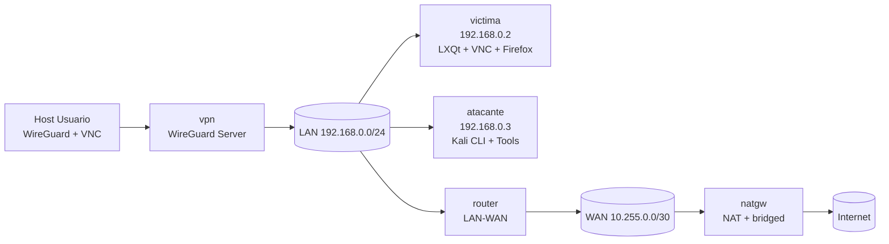
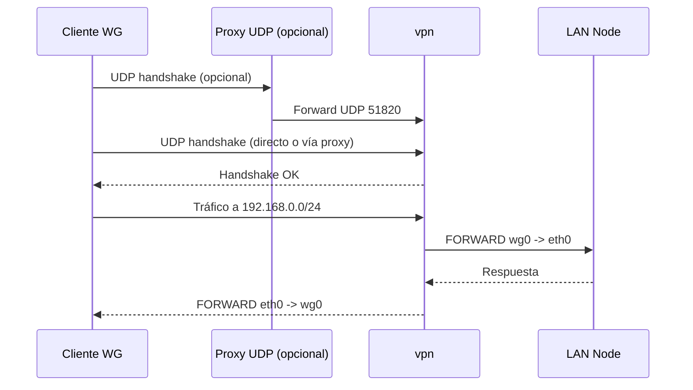
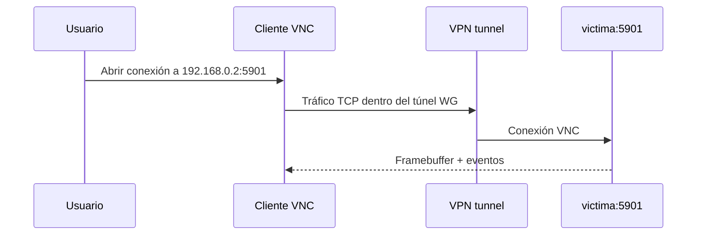
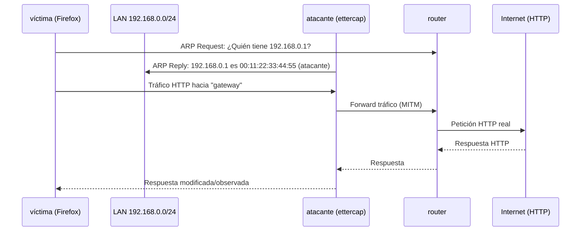
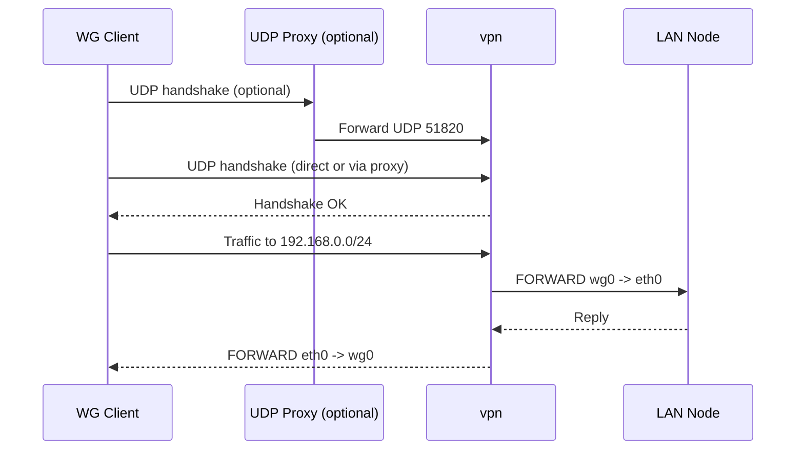
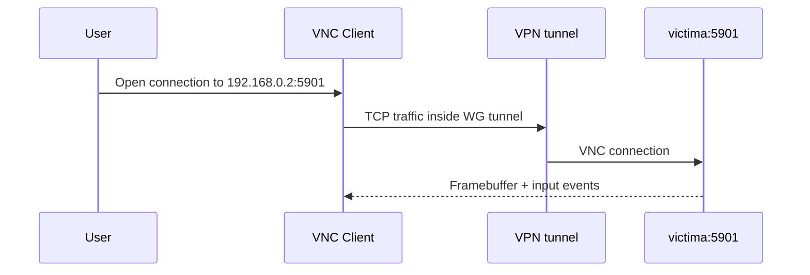
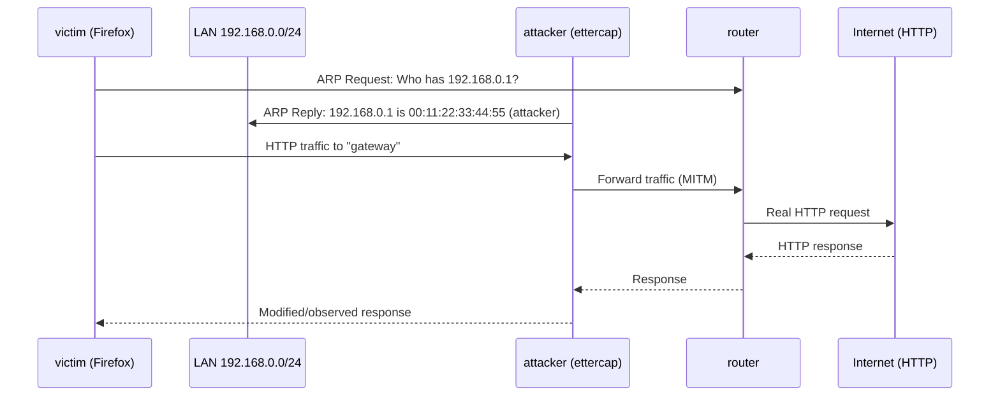

# Architecture - p3 MITM HTTP

Navigation / Navegación: [Index](INDEX.md) | [Guide](README.md) | [Quickstart](QUICKSTART.md) | [Architecture](ARCHITECTURE.md) | [Network](NETWORK.md) | [Examples](EXAMPLES.md) | [Docker](DOCKER.md)

## Español

## 1. Vista de componentes



## 2. Capas funcionales

1. **Acceso remoto**
   - `vpn` expone WireGuard para entrar desde el host.
   - En macOS/Windows se puede activar proxy UDP local de forma automática.

2. **Capa de laboratorio**
   - `victima` con GUI completa (Firefox, VNC) - objetivo del ataque.
   - `atacante` con Kali Linux CLI y herramientas de pentesting.

3. **Capa de salida**
   - `router` conecta LAN a WAN.
   - `natgw` aplica NAT hacia la red del host/Internet.

## 3. Flujo de acceso VPN



## 4. Flujo de acceso VNC (víctima)



## 5. Flujo de ataque MITM HTTP



## 6. Roles por nodo

| Nodo | Función principal | Servicios |
|---|---|---|
| `victima` | Host objetivo con GUI | VNC `:5901`, LXQt, Firefox, objetivo de MITM |
| `atacante` | Host de ataque | Kali CLI, ettercap, arpspoof, wireshark, tcpdump, X11 forwarding |
| `vpn` | Entrada remota segura | WireGuard `51820/udp`, NAT/FORWARD iptables |
| `router` | Enrutamiento LAN-WAN | `ip_forward=1`, ruta por defecto a `natgw` |
| `natgw` | NAT hacia host/Internet | MASQUERADE y forward WAN |

## 7. Seguridad operacional

- El acceso remoto principal es WireGuard, no VNC publicado al host.
- VNC solo es accesible dentro de la LAN del laboratorio (o vía túnel VPN).
- El cliente WireGuard se limita a `WG_ALLOWED_IPS=192.168.0.0/24` por defecto.
- Las claves del cliente/servidor se generan en `./shared/vpn`.
- El atacante está en la misma LAN que la víctima para facilitar ARP spoofing.

## 8. Modos de arranque

- **Completo**: `./start-lab.sh`
  - Arranca todos los nodos
  - Prepara WireGuard
  - Deja listo VNC en `victima` (192.168.0.2:5901)
  
- **CLI-only**: `./start-lab.sh --cli-only`
  - Arranca `victima`, `atacante`, `router`, `natgw`
  - Omite `vpn`
  - La víctima sigue teniendo GUI pero sin acceso remoto VPN

## 9. X11 Forwarding (atacante)

El atacante no tiene GUI nativa. Para usar aplicaciones gráficas:

```bash
# Desde host con X11
kathara exec -d "$(pwd)" atacante "DISPLAY=host.docker.internal:0 wireshark"

# O herramientas CLI
kathara exec -d "$(pwd)" atacante "ettercap -T -q -i eth0"
```

---

## English

## 1. Component view


## 2. Functional layers

1. **Remote access**
   - `vpn` exposes WireGuard for host entry.
   - On macOS/Windows, local UDP proxy may be auto-enabled.

2. **Lab layer**
   - `victima` with full GUI (Firefox, VNC) - attack target.
   - `atacante` with Kali Linux CLI and pentesting tools.

3. **Egress layer**
   - `router` connects LAN to WAN.
   - `natgw` applies NAT to host network/Internet.

## 3. VPN access flow



## 4. VNC access flow (victim)



## 5. MITM HTTP attack flow



## 6. Node roles

| Node | Main function | Services |
|---|---|---|
| `victima` | Target host with GUI | VNC `:5901`, LXQt, Firefox, MITM target |
| `atacante` | Attack host | Kali CLI, ettercap, arpspoof, wireshark, tcpdump, X11 forwarding |
| `vpn` | Secure remote entry | WireGuard `51820/udp`, iptables NAT/FORWARD |
| `router` | LAN-WAN routing | `ip_forward=1`, default route to `natgw` |
| `natgw` | NAT to host/Internet | MASQUERADE and WAN forwarding |

## 7. Operational security

- Primary remote entry is WireGuard, not host-published VNC.
- VNC is only reachable inside lab LAN (or via VPN tunnel).
- WireGuard client scope is limited by default to `192.168.0.0/24`.
- Client/server keys are generated under `./shared/vpn`.
- Attacker is on the same LAN as victim to facilitate ARP spoofing.

## 8. Startup modes

- **Full**: `./start-lab.sh`
  - Starts all nodes
  - Prepares WireGuard
  - Enables VNC in `victima` (192.168.0.2:5901)
  
- **CLI-only**: `./start-lab.sh --cli-only`
  - Starts `victima`, `atacante`, `router`, `natgw`
  - Skips `vpn`
  - Victim still has GUI but without remote VPN access

## 9. X11 Forwarding (attacker)

The attacker has no native GUI. To use graphical applications:

```bash
# From host with X11
kathara exec -d "$(pwd)" atacante "DISPLAY=host.docker.internal:0 wireshark"

# Or CLI tools
kathara exec -d "$(pwd)" atacante "ettercap -T -q -i eth0"
```
